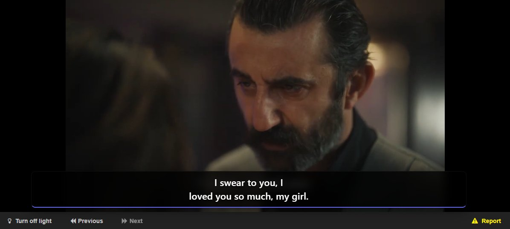
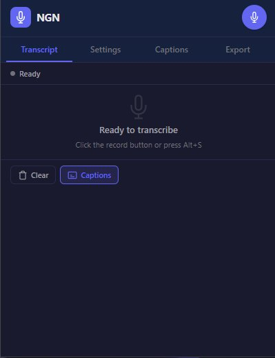
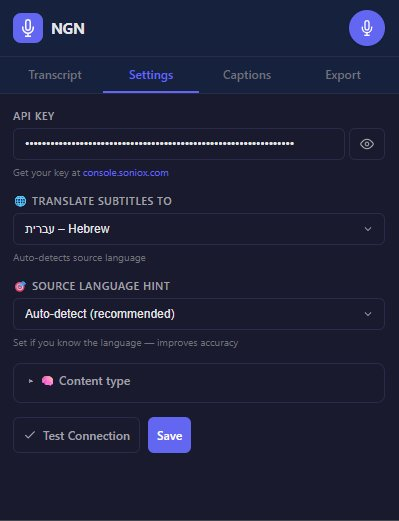
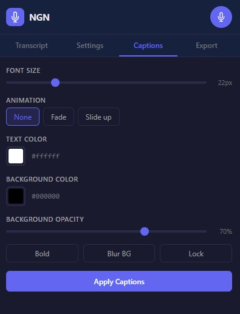
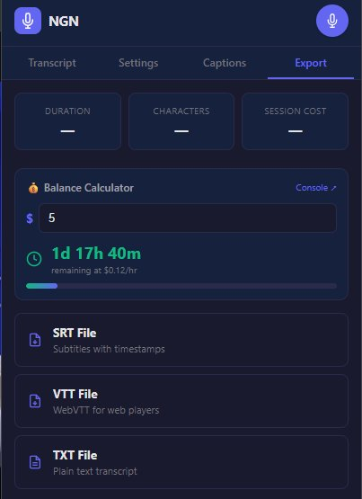

# 🎙️ NGN – AI Audio Transcription

Real-time speech-to-text and translation Chrome extension powered by [Soniox](https://soniox.com) ASR.

Watch any video or meeting in any language — get live subtitles translated to your language, right on the page.


[](https://chromewebstore.google.com/detail/ngn-%E2%80%93-ai-audio-transcript/ehfggcmpnfjmdmkgdhbgmhhmdkhciond)

<p align="center">
  
</p>

<p align="center">
  
  &nbsp;
  
  &nbsp;
  
  &nbsp;
  
</p>

---

## ✨ Features

- **Real-time transcription** — Live speech-to-text from any browser tab
- **61 languages** — Transcribe and translate between all [Soniox-supported languages](https://soniox.com/docs/stt/concepts/supported-languages)
- **Netflix-style subtitles** — Clean, readable captions that appear as complete sentences
- **Subtitle animations** — None, Fade, or Slide-up transitions
- **Draggable & resizable overlay** — Position and size subtitles anywhere on the page
- **Full caption customization** — Font size, text/background colors, opacity, blur, bold, lock position
- **Mini floating player** — Stop recording and access settings, animated audio waves
- **Export SRT/VTT/TXT** — Download subtitles with timestamps for use in any video player
- **Balance calculator** — Track your Soniox credit and see remaining watch time
- **Live session timer** — Real-time duration and cost tracking in the header
- **Speaker diarization** — Identifies different speakers
- **Auto language detection** — Automatically detects the spoken language
- **Keyboard shortcut** — `Alt+S` to toggle recording instantly
- **Tab audio passthrough** — Hear the original audio while transcribing
- **Tabbed UI** — Clean, professional interface with Transcript, Settings, Captions, and Export tabs

## 🚀 Quick Start

### 1. Get a Soniox API Key

Sign up at [soniox.com](https://soniox.com) and get your API key.

### 2. Install the Extension

**Option A — Chrome Web Store (recommended):**

[**Install NGN from Chrome Web Store**](https://chromewebstore.google.com/detail/ngn-%E2%80%93-ai-audio-transcript/ehfggcmpnfjmdmkgdhbgmhhmdkhciond)

**Option B — From source:**

```bash
git clone https://github.com/SoloDax/ngn-transcription.git
```

1. Open `chrome://extensions/`
2. Enable **Developer mode** (top right toggle)
3. Click **Load unpacked**
4. Select the cloned folder

### 3. Configure & Start

1. Click the **NGN icon** in the Chrome toolbar
2. Enter your Soniox API key in the onboarding screen
3. Select translation language (optional)
4. Click the **record button** or press `Alt+S`

## 🎯 Usage

### Starting a Recording

Due to Chrome security restrictions, recording can only be started in two ways:

| Method | How |
|--------|-----|
| **Toolbar icon** | Click the NGN icon → Record button |
| **Keyboard shortcut** | Press `Alt+S` from any tab |

### Tabbed Interface

| Tab | What it does |
|-----|-------------|
| **Transcript** | Live transcript view with clear and caption toggle |
| **Settings** | API key, translation language, source language, content type |
| **Captions** | Font size, animation, colors, opacity, bold, blur, lock |
| **Export** | Session stats, balance calculator, SRT/VTT/TXT download |

### Floating Player

A mini floating button (🎙️) appears on every page:
- **While recording** — Click to stop
- **While stopped** — Click to see start instructions
- **Drag** — Move anywhere on the page
- **⚙️ Gear** — Quick caption settings

### Export Formats

| Format | Description |
|--------|------------|
| **SRT** | Subtitles with timestamps — works with VLC, Premiere, etc. |
| **VTT** | WebVTT format — for HTML5 video players |
| **TXT** | Plain text transcript with optional translation |

### Balance Calculator

Enter your Soniox credit balance in the Export tab to see how much watch time you have remaining. The calculation is based on Soniox's real-time rate of $0.12/hour.

## 🏗️ Architecture

```
┌─────────────┐     ┌──────────────┐     ┌─────────────┐
│  popup.js   │────▶│ background.js│────▶│ offscreen.js│
│  Tabbed UI  │     │  Tab Capture │     │  Audio + ASR│
│  Export/SRT │     │  Msg Router  │     │  Subtitles  │
└─────────────┘     └──────┬───────┘     └─────────────┘
                           │
                    ┌──────▼───────┐
                    │  content.js  │
                    │  Overlay UI  │
                    │  Animations  │
                    │  Float Player│
                    └──────────────┘
```

### Subtitle Engine (Netflix-style)

1. **Accumulate** — Final tokens from Soniox collect in `sentenceBuffer`
2. **Flush triggers** — Sentence punctuation (`. ! ?`), endpoint (`<end>`), 50+ chars, or 1.2s timeout
3. **Display** — Complete subtitle appears with optional fade/slide animation
4. **Reading time** — Stays visible ~40ms per character (min 1.5s, max 3.5s)
5. **Split** — Subtitles over 80 chars split at punctuation boundaries

### SRT/VTT Export

Tokens with `start_ms` and `end_ms` from Soniox are accumulated during the session. On export, they're grouped into subtitle segments (max 42 chars / 5 seconds each) with proper timestamps.

## 📁 Project Structure

```
ngn-transcription/
├── manifest.json            # Extension manifest (V3)
├── popup.html               # Tabbed popup UI
├── offscreen.html           # Offscreen document for audio processing
├── sidepanel.html           # Side panel UI
├── src/
│   ├── popup.js             # Tabs, recording, export, balance calculator
│   ├── popup.css            # Dark theme, tab bar, export cards
│   ├── background.js        # Service worker, tab capture, message routing
│   ├── offscreen.js         # Soniox WebSocket, audio, subtitle engine
│   ├── content.js           # Subtitle overlay, animations, floating player
│   └── caption-overlay.css  # Overlay, player, panel, hint, animation styles
├── screenshots/             # Extension screenshots
├── icons/
│   ├── icon16.png
│   ├── icon48.png
│   └── icon128.png
├── LICENSE
├── CHANGELOG.md
└── .gitignore
```

## 🔒 Privacy

- **No data collection** — Zero analytics, tracking, or telemetry
- **No storage** — Audio is streamed directly to Soniox and never saved
- **Local API key** — Stored only in Chrome's local storage on your machine
- **User-initiated only** — Only captures audio when you explicitly start recording

## 🛠️ Development

### Prerequisites

- Chrome 116+ (Manifest V3 offscreen API)
- Soniox API key ([soniox.com](https://soniox.com))

### Local Development

```bash
git clone https://github.com/SoloDax/ngn-transcription.git
cd ngn-transcription
```

Load as unpacked extension → make changes → reload.

### Debugging

| What | Where |
|------|-------|
| Subtitle processing | ⚙️ → 📋 Log (built-in viewer) |
| WebSocket / audio | `chrome://extensions/` → NGN → offscreen.html |
| Content script | DevTools console, filter `[NGN]` |
| Service worker | `chrome://extensions/` → NGN → service worker |

## 🗺️ Roadmap

- [ ] Dual subtitles (original + translation simultaneously)
- [ ] Speaker colors (different color per speaker)
- [ ] Subtitle history / scroll-back
- [ ] Real-time TTS dubbing via Cartesia
- [ ] Server proxy mode (hide API key from client)
- [x] Chrome Web Store release — [Install from Chrome Web Store](https://chromewebstore.google.com/detail/ngn-%E2%80%93-ai-audio-transcript/ehfggcmpnfjmdmkgdhbgmhhmdkhciond)

## 🤝 Contributing

Contributions are welcome!

1. Fork the repository
2. Create a feature branch (`git checkout -b feature/amazing-feature`)
3. Commit your changes (`git commit -m 'Add amazing feature'`)
4. Push to the branch (`git push origin feature/amazing-feature`)
5. Open a Pull Request

### Areas Where Help is Appreciated

- Improving subtitle timing and readability
- Adding new caption customization options
- Testing with different languages and audio sources
- UI/UX improvements

## 📝 License

MIT License — see [LICENSE](LICENSE) for details.

## 🙏 Acknowledgments

- [Soniox](https://soniox.com) — Real-time speech recognition API
- Built with ❤️ for accessibility and language learning
